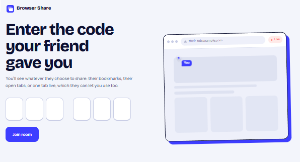
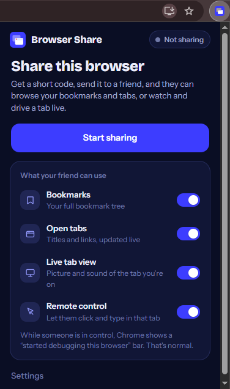
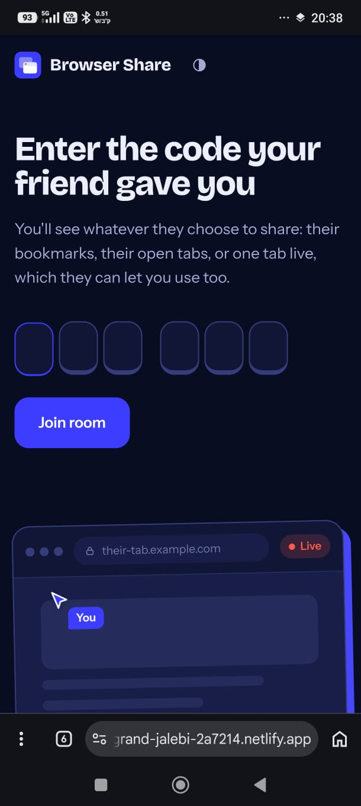
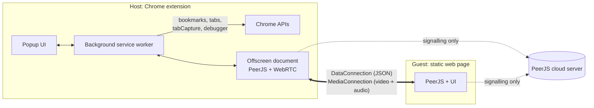
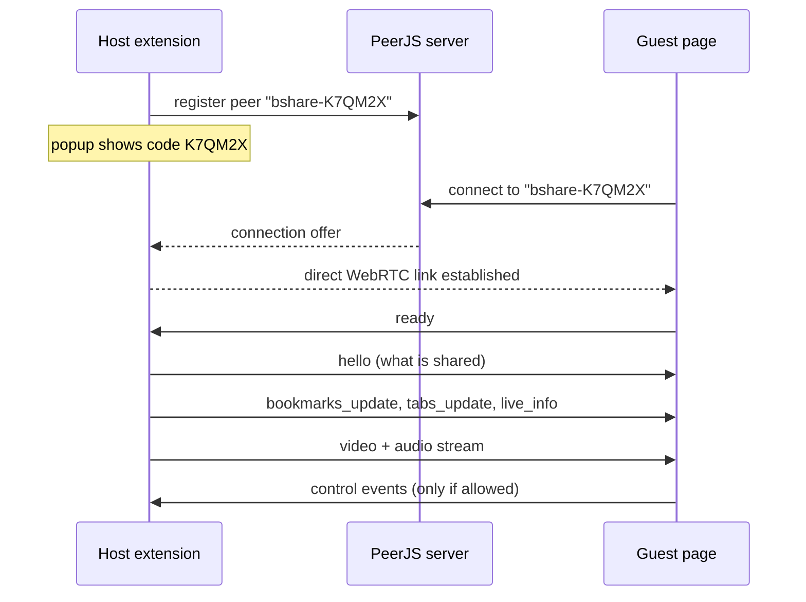

# Browser Share

**Share your browser with a friend using a six-character room code.** They can browse your bookmarks and open tabs, watch a tab live with sound, and, if you allow it, click and type in that tab. Everything travels peer-to-peer over WebRTC. There is no backend to run and nothing is stored on a server.


<p align="center">
  
</p>

---

## Contents

- [Features](#features)
- [Screenshots](#screenshots)
- [How it works](#how-it-works)
- [Quick start](#quick-start)
- [Using it](#using-it)
- [Deploying the guest page](#deploying-the-guest-page)
- [Remote control](#remote-control)
- [Security and privacy](#security-and-privacy)
- [Limitations](#limitations)
- [Troubleshooting](#troubleshooting)
- [Project structure](#project-structure)
- [Protocol reference](#protocol-reference)
- [Development](#development)
- [Roadmap](#roadmap)
- [Acknowledgements](#acknowledgements)
- [License](#license)

---

## Features

| | |
|---|---|
| **Bookmarks** | The host's full bookmark tree, shown as collapsible folders with search. Updates as bookmarks change. |
| **Open tabs** | Titles, links and favicons for every open tab, grouped by window, searchable, and refreshed live. Clicking a tab opens it in the *guest's own* browser. |
| **Live tab view** | Picture and sound of one tab, up to 1080p at 30 fps. The host still hears the tab locally while sharing. |
| **Remote control** | Optional. The guest can click, scroll, type, paste, and use back, forward and reload inside the shared tab. |
| **Room codes** | Six characters from an alphabet without look-alikes (no `I`, `O`, `0`, `1`). Copy the code, or copy a one-click invite link. |
| **Per-feature switches** | Bookmarks, tabs, live view and remote control are each toggled independently, before or during a session. |
| **Always-visible state** | The toolbar badge shows `ON` while a room is open and the number of viewers once someone joins. |
| **No account, no server** | The public PeerJS signalling server only introduces the two browsers. Your data flows directly between them. |
| **Polished UI** | Light and dark themes, a responsive layout that works on phones, bundled fonts, no external requests for assets. |

## Screenshots

<table>
  <tr>
    <td width="50%"><br><sub><b>Guest:</b> live tab view</sub></td>
    <td width="50%" align="center"><br><sub><b>Host:</b> extension popup while sharing</sub></td>
  </tr>
  <tr>
    <td colspan="2" align="center"><br><sub><b>Guest:</b> on a phone</sub></td>
  </tr>
</table>

> Screenshots are renders of the real UI. The live-view frame uses placeholder content.

## How it works

Browsers do not let a normal web page read another browser's bookmarks or tabs, so the two sides are built differently:

- **Host** is a **Chrome extension (Manifest V3)**. Only an extension can read bookmarks and tabs, capture a tab, and inject input.
- **Guest** is a **plain static web page**. No extension and no install: open a link, enter the code.



**Why an offscreen document?** MV3 background service workers cannot use WebRTC. The extension keeps the PeerJS peer in an [offscreen document](https://developer.chrome.com/docs/extensions/reference/api/offscreen); the service worker gathers bookmarks and tabs, listens for changes, and applies remote-control input.

**Joining a room**



**Live view details.** The popup asks Chrome for a tab-capture stream ID for the tab you are on (this is what `activeTab` permits). The offscreen document turns that ID into a `MediaStream` (video and audio) and calls each guest with it. Capturing a tab normally silences it for the host, so the audio is routed back to the host's speakers through the Web Audio API. Video is capped at 1920×1080, 30 fps and 6 Mbps, tuned to keep text readable.

## Quick start

You need Chrome (or another Chromium browser) **116 or newer** for the host, and any modern browser for the guest.

> **Live demo:** the guest page is already deployed at **<https://grand-jalebi-2a7214.netlify.app/>**. Install the extension below, paste that address into its **Settings**, and you can send a working invite link right away, no deployment needed.

### 1. Install the host extension

1. Download or clone this repository.
2. Open `chrome://extensions` and switch on **Developer mode**.
3. Click **Load unpacked** and choose the `browser-share-extension` folder.
4. Pin the extension so its icon and badge stay visible.

### 2. Serve the guest page

The guest page is static files with no build step. For a quick local test:

```bash
cd browser-share-guest
python -m http.server 8080      # on Windows you can also use: py -m http.server 8080
```

Open <http://localhost:8080>. To let a friend on another network use it, [deploy it](#deploying-the-guest-page) to any static host.

### 3. Connect the two

1. Click the extension icon, then **Start sharing**.
2. Open **Settings** in the popup and paste your guest page address — the live demo above, or your own deployment (for example `https://you.github.io/browser-share/`). This makes **Copy invite link** produce `https://…/?room=CODE`.
3. Send the code or the invite link to your friend.
4. They open the page, enter the code, and press **Join room**.

## Using it

### Host

| Control | What it does |
|---|---|
| **Start sharing / Stop sharing** | Opens or closes the room and disconnects everyone. |
| **Copy code / Copy invite link** | Copies the six-character code, or a link that joins automatically. |
| **Bookmarks** | Share your bookmark tree. |
| **Open tabs** | Share titles and links of all open tabs, in every window. |
| **Live tab view** | Stream the tab you are on, with sound. Turn it on while viewing the tab you want to share. |
| **Share this tab instead** | Switch the live view to the tab you are on now. |
| **Remote control** | Let guests click and type in the shared tab. Only applies while live view is on. |
| **Settings** | Guest page address used for invite links. |

Toggles are saved and take effect immediately, including in the middle of a session.

### Guest

- **Live view** shows the shared tab in a browser-style frame with the current address, a live indicator, resolution, a speaker button (mute and unmute, remembered between visits) and full screen.
- **Open tabs** and **Bookmarks** are searchable. Clicking an entry opens it in a new tab on *your* device. Internal browser pages such as `chrome://` are listed but not clickable.
- **Take control** (when the host allows it) sends your mouse and keyboard to the shared tab. See [Remote control](#remote-control).
- The connection indicator shows round-trip latency and switches to a warning colour when the link is slow. If the connection drops, the page retries automatically several times before returning to the join screen.
- Invite links can carry the code as `?room=CODE` (or `#CODE`) and join automatically.

## Deploying the guest page

The guest page is a folder of static files, so any static host works: GitHub Pages, Netlify, Cloudflare Pages, Vercel, an S3 bucket, or your own web server. Serving over HTTPS is recommended.

## Remote control

Remote control is implemented with the [`chrome.debugger`](https://developer.chrome.com/docs/extensions/reference/api/debugger) API and the Chrome DevTools Protocol.

- Guests send input as coordinates relative to the video frame (0 to 1). The host maps them onto the tab's real viewport, so it keeps working when the guest resizes their window or goes full screen.
- Supported input: mouse move, down and up (all buttons, double clicks, drags), wheel, keyboard including modifiers and non-Latin characters, paste, and navigation (back, forward, reload, open a URL from the tab or bookmark lists). On touch screens, one-finger drag scrolls and a tap clicks.
- The debugger attaches **only when the first input arrives** and detaches when the guest releases control, the host turns the feature off, or sharing stops.
- **Chrome shows a "started debugging this browser" bar** on the tab while attached. This is a Chrome safeguard and cannot be removed by an extension. If you run your own Chrome profile and want it hidden, launch Chrome with `--silent-debugger-extension-api`.
- There is deliberately **no confirmation prompt** on the host when a guest takes control. Only enable remote control for people you trust. See [Security and privacy](#security-and-privacy).
- Control acts on the **shared tab only**, and only while live view is on.

## Security and privacy

**What is protected**

- Traffic between host and guest is encrypted by WebRTC (DTLS/SRTP).
- Guests can only see the categories you have switched on. They cannot read anything else from your browser.
- There is no application server, and the extension never uploads your data anywhere except to connected guests.

**What to be aware of**

- **The room code is the only credential.** There is no password or approval step. Anyone who has the code while the room is open can join. Codes are drawn from 32⁶ (about 1.07 billion) combinations. Share the code privately, and stop sharing when you are done.
- **Several people can join at once, and every guest can take control.** There is no per-viewer permission or arbitration. Control events from any guest are applied.
- **Remote control is powerful.** A guest with control can act as you inside the shared tab: click, type, navigate, and use any site you are logged in to there. Turn **Remote control** off unless you need it, and avoid sharing tabs showing sensitive accounts.
- **Shared URLs may contain secrets.** Tab and bookmark URLs can include tokens or private paths. Turn off **Open tabs** or **Bookmarks** if that matters.
- **Signalling and relay.** Connection setup goes through the public PeerJS cloud server, which sees the room ID and network addresses needed to connect but not your data. PeerJS's default configuration also includes public STUN servers and a TURN relay. If a direct connection is impossible, traffic may be relayed (still encrypted). You can point both pages at your own PeerJS server and ICE servers for full control (see [Development](#development)).
- **Favicons on the guest page.** For entries without a favicon from the host, the guest page requests one from Google's favicon service using the site's domain. That reveals those domains to Google from the *guest's* browser. Replace the URL in `favicon()` in `join.js` if you want to avoid it.
- **Untrusted data is never parsed as HTML.** The guest page builds its interface with DOM APIs and `textContent`, so a hostile tab title or bookmark name cannot inject markup.

## Limitations

- **One live tab at a time**, the one you were on when you switched live view on (or last pressed **Share this tab instead**). Following your active tab automatically is not possible with Chrome's capture permissions.
- **Chrome internal pages** (`chrome://…`, the Chrome Web Store, other extensions' pages) cannot be captured or controlled.
- **Audio is always shared** with the live view. There is no separate mute for the host yet.
- **Chromium only for the host.** The extension relies on `tabCapture`, `offscreen` and `debugger`, which are Chromium APIs.
- **Public signalling server.** The default PeerJS cloud is a shared free service with no uptime guarantee. Self-host `peerjs-server` if you need reliability.
- **Restrictive networks.** Some corporate firewalls block WebRTC. A TURN relay may be needed there.
- **Clipboard.** Guests can paste text into the shared tab, but copying from the shared tab back to the guest is not supported.

## Troubleshooting

| Symptom | What to check |
|---|---|
| **"Chrome does not allow sharing internal pages"** | The tab you were on is a `chrome://` page, the New Tab page, or the Web Store. Switch to a normal website tab, open the popup, and turn **Live tab view** on again. |
| **Guest: "No room with that code"** | Check the code. The room only exists while the host is sharing. Confirm the popup shows the room as open and that you did not stop sharing. |
| **Guest connects but sees no video** | Live tab view must be on, and the shared tab must be a normal `http(s)` page. Try **Share this tab instead** in the popup. |
| **No sound on the guest side** | Browsers block sound until the page has been clicked. Click anywhere, or press the speaker button. The button only appears when the tab is sending audio. |
| **Host stopped hearing the tab** | Turn live view off and on again. The extension restores local playback when a new capture starts. |
| **Control does nothing** | Remote control must be enabled in the popup and live view must be on. Some pages cannot be attached to (internal pages, the Web Store). The guest sees a message when that happens. |
| **Yellow "debugging" bar appears** | Expected while a guest has control. See [Remote control](#remote-control). |
| **Stuck on "Connecting" or timing out** | Check both internet connections. Corporate or school networks may block WebRTC. Try another network, or add a TURN server. |
| **Extension seems idle after a browser restart** | Sharing does not persist across browser restarts. Press **Start sharing** again to get a new code. |

## Project structure

```
.
├── browser-share-extension/        Host: Chrome extension (Manifest V3)
│   ├── manifest.json
│   ├── background.js               State, bookmark/tab listeners, debugger control
│   ├── offscreen.html
│   ├── offscreen.js                PeerJS peer, data channel, media calls
│   ├── popup.html
│   ├── popup.css
│   ├── popup.js                    Popup UI, tab-capture start
│   ├── lib/peerjs.min.js           PeerJS 1.5.5, bundled (no CDN)
│   ├── fonts/                      Bricolage Grotesque, Instrument Sans (OFL)
│   └── icons/
├── browser-share-guest/            Guest: static web page
│   ├── index.html
│   ├── styles.css
│   ├── join.js                     Join flow, rendering, input capture
│   ├── lib/peerjs.min.js
│   └── fonts/
├── docs/screenshots/
└── .github/workflows/pages.yml     Deploys the guest page to GitHub Pages
```

### Extension permissions

| Permission | Why it is needed |
|---|---|
| `bookmarks` | Read the bookmark tree and detect changes. |
| `tabs` | Read titles, URLs and favicons of open tabs and detect changes. |
| `tabCapture` | Capture the video and audio of the shared tab. |
| `activeTab` | Lets the popup obtain a capture stream for the tab you are on. |
| `offscreen` | Host the WebRTC peer, which service workers cannot run. |
| `debugger` | Inject mouse and keyboard input for remote control. |
| `storage` | Remember your toggles, guest page address and in-progress session state. |

## Protocol reference

Host and guest exchange small JSON messages over a PeerJS `DataConnection` (default binary serialization, chunked automatically). The peer ID of a room is `bshare-` followed by the six-character code.

**Host to guest**

| `type` | Payload | Meaning |
|---|---|---|
| `hello` | `{ v, caps }` | Sent on connect. `caps` is `{ bookmarks, tabs, live, control }`. |
| `caps` | `{ caps }` | Sharing switches changed. |
| `bookmarks_update` | `payload`: trimmed `chrome.bookmarks.getTree()` result (`id`, `title`, `url`, `children`, `dateAdded`) | Full tree. |
| `tabs_update` | `payload`: `[{ id, windowId, index, title, url, favIconUrl, active, pinned, audible }]` | Full tab list. |
| `live_info` | `{ active, tabId, title, url }` | Which tab is being streamed. |
| `control_status` | `{ active, reason?, error? }` | Control attached, released or refused. |
| `pong` | `{ t }` | Reply to `ping`, used for latency. |
| `bye` | none | Host stopped sharing. |

The live tab arrives separately as a PeerJS `MediaConnection` initiated by the host.

**Guest to host**

| `type` | Payload | Meaning |
|---|---|---|
| `ready` / `request_refresh` | none | Ask for a fresh snapshot. |
| `ping` | `{ t }` | Latency probe. |
| `control` | `{ event }` | Input event, below. |

**Control events** (`event.kind`)

| `kind` | Fields |
|---|---|
| `mouse` | `action` (`move`, `down`, `up`, `wheel`), `x`, `y` (0 to 1 within the video), `button`, `buttons`, `clicks`, `dx`, `dy`, `mods` |
| `key` | `action` (`down`, `up`), `key`, `code`, `keyCode`, `mods` |
| `text` | `text` (pasted text) |
| `nav` | `action` (`back`, `forward`, `reload`, `url`), `url` for `url` (only `http` and `https`) |
| `release` | Detach the debugger |

`mods` is a bitmask: Alt = 1, Ctrl = 2, Meta = 4, Shift = 8.

## Development

There is no build step. Edit the files and reload.

**Extension**

- After changing code, open `chrome://extensions` and click the reload icon on the card.
- Inspect the **service worker** and the **offscreen document** from the same card (*Inspect views*). The offscreen document is where WebRTC and PeerJS errors show up.
- Sharing state is kept in `chrome.storage.session`, so the service worker can be restarted by Chrome without losing the room.

**Guest**

- Serve `browser-share-guest/` with any static server and open it in two windows to test against a host.
- Query parameters: `?room=CODE` fills in the code and joins automatically.

**Using your own signalling and ICE servers**

Both `offscreen.js` (host) and `join.js` (guest) create their peer with `new Peer(...)`. To use a self-hosted [`peerjs-server`](https://github.com/peers/peerjs-server) or your own STUN and TURN servers, pass the same options on both sides:

```js
new Peer(id, {
  host: 'peer.example.com', port: 443, path: '/', secure: true,
  config: { iceServers: [
    { urls: 'stun:stun.example.com:3478' },
    { urls: 'turn:turn.example.com:3478', username: 'user', credential: 'pass' }
  ] }
});
```

**Updating PeerJS**

Replace `lib/peerjs.min.js` in both folders with `dist/peerjs.min.js` from the [`peerjs` npm package](https://www.npmjs.com/package/peerjs). The extension bundles it locally because extension pages cannot load remote scripts.

## Roadmap

Ideas, not promises:

- Host-side switch to share the live tab silently
- Host approval prompt and optional room password
- Per-viewer permissions, and a "who has control" indicator
- Copy from the shared tab back to the guest
- Follow the active tab automatically while live view is on
- Firefox host support for bookmarks and tabs sharing

## Acknowledgements

- [PeerJS](https://peerjs.com/) for the WebRTC layer (MIT).
- [Bricolage Grotesque](https://github.com/ateliertriay/bricolage) and [Instrument Sans](https://github.com/Instrument/instrument-sans), both under the SIL Open Font License 1.1, bundled via [Fontsource](https://fontsource.org/).

## License

Released under the MIT License. Add a `LICENSE` file with your name and year before publishing. Bundled third-party components keep their own licenses (PeerJS: MIT, fonts: SIL OFL 1.1; license texts are in the `fonts/` folders).
